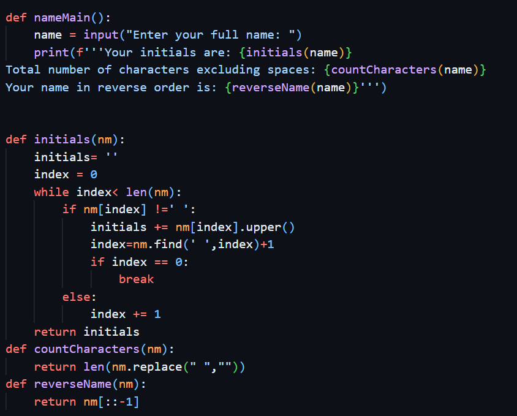
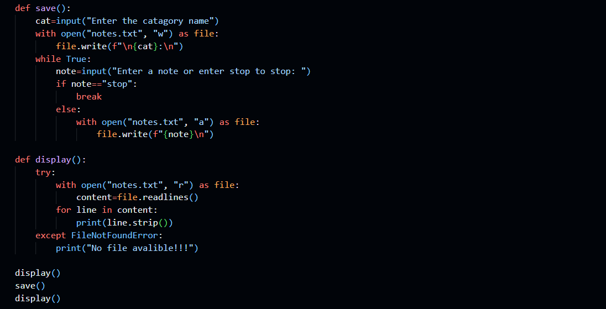
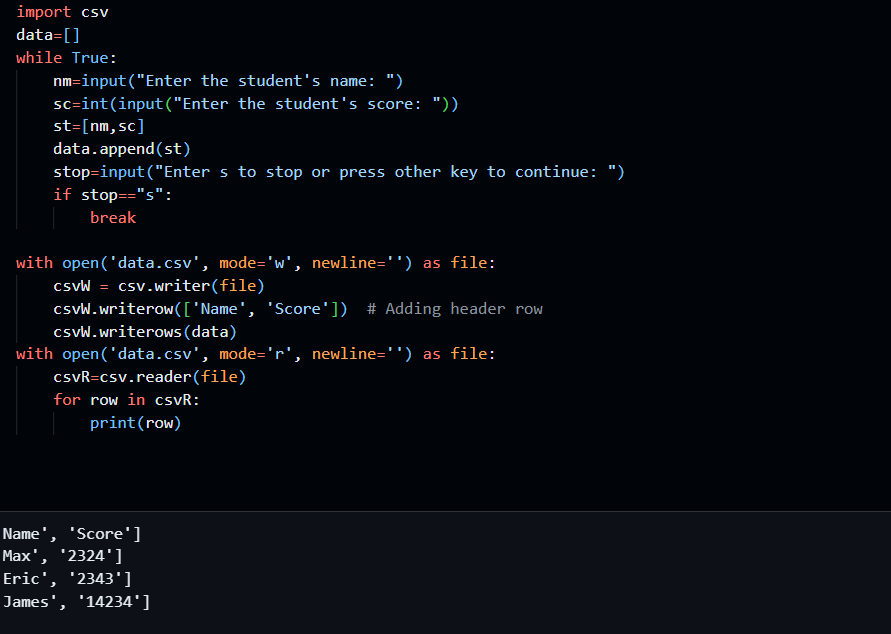

# School programming award solutions
I did a programming award at school focusing on python and I put the solutions to my work here. I learnt the basics of programming in python up to how to use data bases to store and retreive information and how to use objects and how to save data with pickling.
## The Basics

This was some simple stuff, learning how to define and use functions, and how to use while loops.

I also learnt about if statements, try and except, and writing to files.

I then went on to do csv files.

## Db and Objects
[Challenges i have done for objects](https://github.com/Mxgharris/Solutions-Programming_Award/blob/main/PythonAward/Week7/Challanges%20Week%207.ipynb)
[Challenges for data bases](https://github.com/Mxgharris/Solutions-Programming_Award/blob/main/PythonAward/Week7/Challange%20Uni%20db.ipynb)

